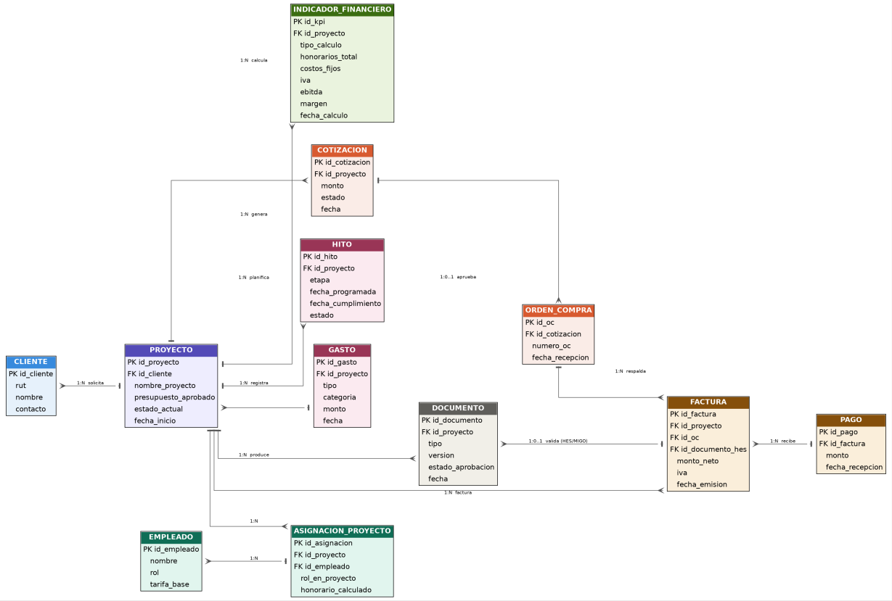

# Modelo de datos preliminar

## Diagrama entidad-relación

Entidades centrales del to-be, con cardinalidades y PK candidatas.

## Entidades

| Entidad | PK candidata | FK principales | Por qué existe |
|---|---|---|---|
| Cliente | Id_cliente (rut como clave natural alternativa) | - | Quien solicita el proyecto |
| Proyecto | Id_proyecto | Id_cliente | Núcleo del modelo: guarda presupuesto y estado_actual |
| Cotización | Id_cotización | Id_proyecto | Puede existir más de una si se rechaza y se pide otra |
| Orden_compra | Id_oc | Id_cotización | Solo existe si la cotización fue aprobada |
| Empleado | Id_empleado | - | Camarógrafo, editor, guionista |
| Asignación_proyecto | Id_asignación | Id_proyecto, id_empleado | Resuelve el N:M |
| Hito | Id_gasto | Id_proyecto | Cada ítem de la carta Gantt (preproducción, grabación) |
| Gasto | Id_gasto | Id_proyecto | Costos fijos y variables (bencina, arriendos) |
| Documento | Id_documento | Id_proyecto | Guion, HES/MIGO, producto final (todos con estado de aprobación) |
| Factura | Id_factura | Id_proyecto, id_oc, id_documento_hes | Respaldada por OC + HES/MIGO |
| Pago | Id_pago | Id_factura | Puede haber anticipo + pago final |
| Indicador_financiero | Id_kpi | Id_proyecto | Snapshot de honorarios/IVA/EBITDA/margen; se calcula dos veces (estimado al aceptar cotización y real al cierre) |

## Cómo sostiene el proceso to-be

El modelo de datos sostiene el proceso to-be porque cada tarea que involucra al SIG tiene una entidad o atributo asociado donde queda registrada. Al ingresar los datos del proyecto y presupuesto se crea el registro en Proyecto y Cotización; al asignar equipo y programar hitos se generan filas en Asignación_Proyecto e Hito, que en conjunto constituyen la Carta Gantt. Los cambios de estado del proyecto (Preproducción, Grabación, Postproducción, Cierre) actualizan el atributo estado_actual de Proyecto de forma manual, respetando el requisito explícito del dueño de no automatizar los avances de proceso. El cálculo automático de honorarios, IVA, EBITDA y márgenes se traduce en dos registros de Indicador_Financiero (uno estimado al aceptar la cotización y uno real al cierre), lo que permite trazar la ganancia real versus la proyectada — resolviendo directamente el problema de negocio detectado en la entrevista ("se pierden montos... se termina perdiendo el conocimiento real de las ganancias").

Este modelo es preliminar; se detallarán tipos de dato, normalización y claves foráneas completas en la Entrega 2.
